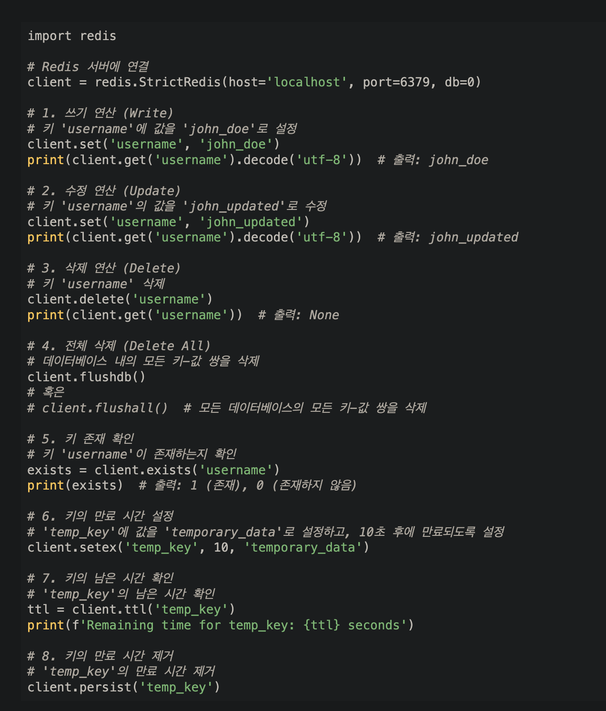

### Redis 총론
- Key, Value 구조의 비정형 데이터를 저장하고 관리하기 위한 오픈 소스 기반의 비관계형 데이터 베이스 관리시스템(DBMS)
    - *비정형데이터 : 예측이 불가능하여 고정되어 있는 필드에 저장되어 있지 않은 데이터이며 테이블과 스키마가 정해져 있지 않음*
- 데이터베이스, 캐시, 메세지 브로커로 사용되며 인메모리 구조를 가진 저장소임
- String, Lists, Sets, Sorted Sets, Hashes 자료 구조를 지원함

### Redis 사용 시 주의점
- 인메모리 데이터 저장소의 특징으로 서버에 장애가 발생하면 데이터 유실이 발생할 수 있음. 이에 따라 장애에 대한 운영 플랜이 필요함
- 싱글 스레드의 특성상 한 번에 하나의 명령어만 처리가 가능함으로 시간이 오래 걸리는 스레드를 처리하는 명령은 상황에 따라 사용하는 것이 필요함 
- 이에 따라 Master-slave 데이터 이중화 구조에 대한 Redis Replication, 분산처리를 위한 Redis Cluster, 장애 복구 시스템 Redis Sentinel, 
  Redis Topology, Redis Sharding, Redis Failover 등의 구조가 있음 

### Redis 데이터 처리 명령어
|종류|역할|
|:--:|:--:|
|Set|데이터 저장|
|Get|저장된 데이터 조회|
|rename|저장된 데이터 변경|
|randomkey|저장된 key 중에 하나의 key를 랜덤하게 검색|
|keys|저장된 모든 key를 검색|
|exits|검색 대상 key 존재여부 확인|
|mset|여러 개의 데이터 저장|
|mget|여러 개의 데이터 검색|

### Redis 사용 방법
- 설치는 [redis.io](redis.io/) 또는 ```brew install redis```로 설치가 가능함
- 도커 환경에서는 ```docker run -p 6379:6379 redis ``` 에서 설치 가능함
- ```redis_cli``` 를 통해 명령어 실행이 가능함
- Redis 중지는 ctrl + c 로 가능함
- Redis Key-Value 기능
 


### Cache Server
- Redis 를 공부하기에 앞서 Redis에서 사용하는 Cache Server를 선행해서 공부함
    - 데이터베이스 있는데 Redis(인메모리 데이터 구조 저장소)를 사용하는 이유는 무엇인가
         - DB는 데이터를 물리 디스크에 직접 쓰기 때문에 서버에 문제가 발생하여 다운되더라도 데이터는 손실되지 않으나 매번 디스크에 접근하기 때문에 사용자가 많아지면 부하가 발생함
         - 서비스 초기에는 기본적인 **"WEB-WAS-DB"** 구조로 부하가 없으나 USER가 늘어난다면 부하 문제가 발생하므로 캐시 서버를 도입하여 사용함
         - 이 캐시 서버로 이용할 수 있는 것이 Redis 임


### RDBMS 개념정의
- 관계형 데이터베이스 관리 시스템(Relational DBMS)
- 데이터를 테이블 형태로 저장하고 관리하는 데이터베이스이며 일반적으로 SQL 을 사용해서 데이터를 관리한다
- 이러한 관계를 나타내기 위해 외래키(FK)를 사용하며 FK를 사용하여 테이블 간 Join을 할 수 있다
- Column 과 Row형태로 저장이 가능하며 쿼리를 통해 데이터를 다룬다
- 반드시 Schema규격에 맞춰야 해 유연한 데이터 저장/관리가 불가하다

#### RDBMS 장단점
- 장점
    - 정해진 스키마에 따라 데이터를 저장하여야 하므로 명확한 데이터 구조를 보장한다
    - 관계는 각 데이터를 중복없이 한번만 저장이 가능하다

- 단점
    - 테이블 간 관계를 맺고 있어 특정한 데이터를 조회하기 위해 Join문이 늘어나 쿼리 자체가 복잡해 질 수 있다
    - 스키마로 인해 유연하지 못하고 스키마가 변경될 경우 많은 작업 공수가 필요하다

### NoSQL 개념정의
- NoSQL의 특징
    - 유연성 : 스키마 선언이 없어 필드의 추가 및 삭제가 자유로운 Schema-less 구조이다
    - 확장성 : 스케일 아웃(수평확장)에 의한 서버 확장이 용이하다
    - 고성능 : 대용량 데이터를 처리하는 성능이 뛰어나다
    - 가용성 : 여러대의 백업 서버 구성이 가능하여 장애 발생 시에도 무중단 서비스가 가능하다
    - 데이터 간의 관계를 정의하지 않아 Table 간에 Join 도 불가능하다

#### NoSQL 장단점
- 장점
    - 데이터 분산이 용이하며 성능 향상을 위한 Scale-Out 및 Scale-up 이 가능하다
    - 데이터 모델의 유연한 변화가 가능하다

- 단점
    - 데이터가 여러 컬렉션에 중복저장이 되어 있어 데이터의 수정 또는 삭제가 필요하다면 데이터가 저장된 모든 컬렉션에 대해 수행해야 한다
    - 스키마가 존재하지 않아 데이터의 구조 정의가 어렵다
    - 확장성과 일관성은 반비례하며 확장성이 올라가는 만큼 일관성은 떨어질 수 있다

#### NoSQL 종류
- Key-Value DB
- Document DB
- Graph DB
- Column Family DB

    - Key-Value DB
        - Key-Value 쌍으로 저장되며 어떠한 형태의 데이터도 담을 수 있다(이미지나 비디오도 가능) 
        - 성능향상을 위한 데이터 캐싱, 장바구니 같은 웹 어플리케이션에서 일시적인 속성 추적, 이미지나 오디오 같은 대용량 객체 저장, 대용량 로그 저장에서 사용한다
        - Redis, Oracle Berkely, AWS DynamoDB

    - Document DB
        - Key-document의 형태로 저장되며 Value 가 계층적인 형태인 Documnet로 저장이 된다. 이는 객체지향에서의 객체와 유사하며 하나의 단위로 취급되어 저장이 된다. (하나의 객체를 여러개의 테이블에 나눠서 저장할 필요가 없다)
        - 단점으로는 쿼리가 SQL과 다르며 질의의 결과가 json이나 xml형태로 출력이 되기 때문에 RDBMS에서 질의 결과를 사용하는 방법과 상이하다
        - 대용량 데이터를 읽고 쓰는 서비스, 다양한 속성이 있는 데이터, 유형이 다양해질 수 있는 메타데이터, 비정규화된 중첩구조의 데이터를 사용하는 백엔드
        - MongoDB, CouchDB, AWS DocumentDB

#### Redis 와 MongoDB 
- Redis 는 Key-Value 구조를 가지는 인메모리 데이터 저장소 이다. 반면 MongoDB는 Document형태의 데이터 구조를 가지며, 디스크 기반으로 데이터를 저장한다. 이러한 차이로 인해 Redis는 메모리 기반으로 빠른 데이터 처리가 가능하며 주로 캐싱에 사용되는 반면, MongoDB는 대용량의 데이터를 저장하고 관리하는 데 적합하다
- Redis는 캐싱, 메시징, 실시간 분석, 게임 랭킹, 세션 관리 등에서 사용되며 주요하게 사용하는 회사는 트위터, 깃헙, 핀더레스트 이다. MongoDB는 웹 애플리케이션, 모바일 애플리케이션, 로그 관리 분야에서 사용이 된다 


* *출처*
 *- https://bugoverdose.github.io/development/redis-set-basics/*
 *- https://seokhyun2.tistory.com/63*
 *- https://velog.io/@coastby/Redis-Redis%EC%9D%98-%ED%8A%B9%EC%A7%95%EA%B3%BC-%EC%82%AC%EC%9A%A9%EB%B2%95*
 *- https://datasciencebeehive.tistory.com/22*
 *- https://noxknow.tistory.com/88*
