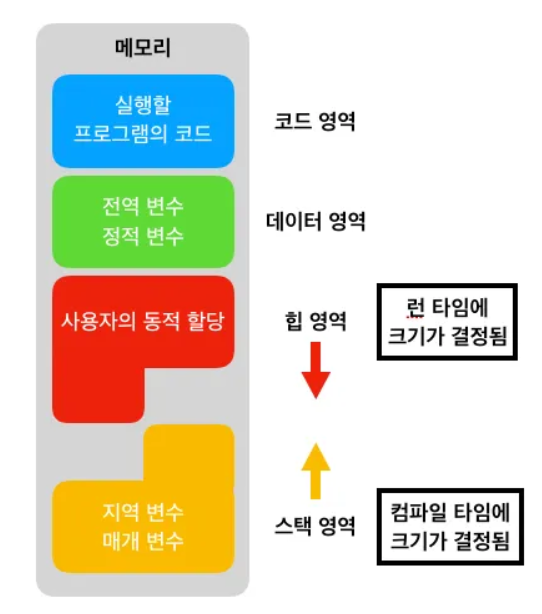
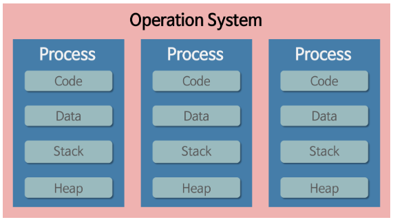

## CS 총론 1
### 운영 체제
- 시스템의 자원과 동작을 관리하는 소프트웨어
- 프로세스, 저장장치, 네트워킹, 사용자, 하드웨어를 관리
### 메모리 구조
- 메모리 공간 종류 4가지 
    - Code, Data, Heap, Stack
    - 
    - 운영체제에서 프로그램을 실행하면 프로그램 정보를 읽어 RAM에 로드하고
    - cpu 는 프로그램 코드를 가져다 주기억장치에서 실행한다
    
    - 프로그램을 실행하면 OS 는 메모리에 공간을 할당하고 할당해주는 메모리 공간은 아래의 4가지가 있다
    - 
    - Code : 실행할 프로그램의 코드가 저장되는 영역. 함수, 제어문, 상수
    - Data : 전역변수와 static 변수가 할당되는 영역. 프로그램 시작과 동시에 할당되고 프로그램이 종료되어야 메모리가 소멸되는 영역
    - Stack(LIFO) : 프로그램이 사용하는 임시 메모리 영역. 함수 호출 시 생성되는 지역변수와 매개변수가 저장되는 영역이고 함수 호출이 완료되면 사라짐
    - Heap (FIFO) : 사용자가 관리하는 공간으로 데이터가 동적으로 할당됨. 가바지 컬렉터가 자동으로 해제하는 공간(=동적할당)
### 프로세스, 스레드
- 프로세스 : 메모리에 올라와 실행중인 프로그램
    - 
    - 프로세스는 각각의 독립된 메모리를 할당받는다
    - 별도의 주소 공간에서 실행되며, 각 프로세스는 다른 프로세스의 변수나 자료구조에 접근할 수 없다
    - but, 프로세스 간의 통신 (파이프, 소켓 등의 통신)으로 접근 가능하다
- 스레드 : 프로세스 안에서 실행하는 단위. 스레드가 여러개가 돌면 프로세스화 된다
     - Stack 만 따로 할당받고(독립적으로 사용) Code, Data, Heap 영역은 공유한다
     - 같은 프로세스 안에 있는 여러 스레드들은 같은 힙공간을 공유한다. 반면에 프로세스는 다른 프로세스의 메모리에 직접 접근할 수 없다
     - 각각의 스레드는 별도의 레지스터와 스택을 갖고 있지만 힙 메모리는 서로 읽고 쓸 수 있다
     - 한 스레드가 프로세스 자원을 변경하면 다른 이웃 스레드 (sibling thread)도 그 변경 결과를 볼 수 있다
### CPU 스케쥴러
### 가상메모리
### 데드락
